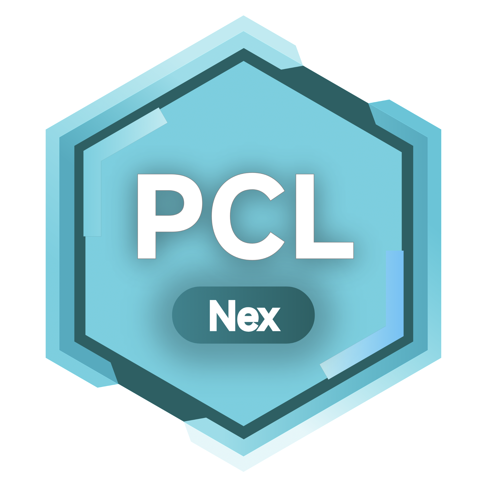

# PCL2-Nex

**基于 PCL2 的 Minecraft 启动器**  
专注于丰富的联机功能与插件扩展

---

## 📖 简介

**PCL2-Nex** 是一款基于 [Plain Craft Launcher 2 (PCL2)](https://github.com/Meloong-Git/PCL) 及其社区版 [PCL2-CE](https://github.com/PCL-Community/PCL2-CE) 的 Minecraft 启动器项目。  

在保留原版简洁流畅体验的基础上，引入了 **Nex插件扩展接口规范**（**[pcl2-nex-api](https://github.com/PCL-Nex-Developer/pcl2-nex-api)**），并重点增强了联机功能与扩展性。

---

## ✨ 核心特性

* **API 扩展**：通过 **pcl2-nex-api** 接口规范实现插件化扩展，插件可与启动器核心交互。
* **联机增强**：优化多人游戏连接体验，提高稳定性与互动性。
* **自由定制**：支持基于接口的深度自定义，不修改核心即可扩展功能。

---

## 🔗 致谢与上游

本项目基于以下开源项目开发：
* **[PCL2 (Meloong-Git)](https://github.com/Meloong-Git/PCL)** – 基于该库修改
* **[PCL.Core（PCL-Community）](https://github.com/PCL-Community/PCL.Core)** – 提供部分核心库源码
* **[PCL2-Nex-API](https://github.com/PCL-Nex-Developer/pcl2-nex-api)** – 提供Plugin API映射支持

---

## 📦 安装与使用

1. 前往 [Releases](#) 页面下载最新版本。  
2. 解压并运行 `PCL2-Nex.exe`。  
3. 根据提示完成 Minecraft 游戏环境配置。

---

## ⚖️ 许可证

* **PCL2-Nex** 采用 **与PCL2上游一致的协议**。  
  您需遵守pcl2协议条款。详情请参阅根目录 `LICENSE` 文件。

* **PCL-Nex-Core** 采用 **与PCL.Core一致的协议**。  
  您需遵守Apache-2.0 License。详情请参阅根目录 `LICENSE.Core` 文件。

---

<strong>PCL-Nex-Developer</strong>

